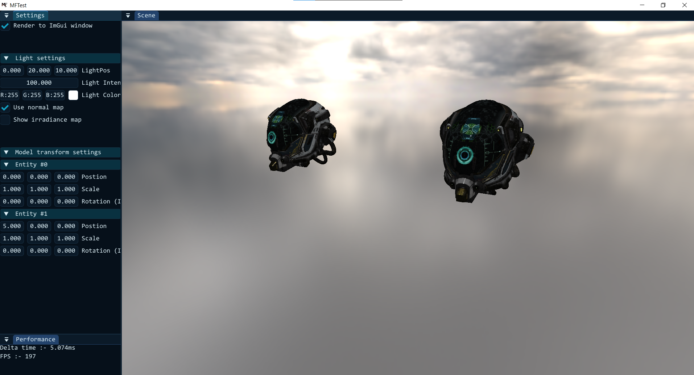
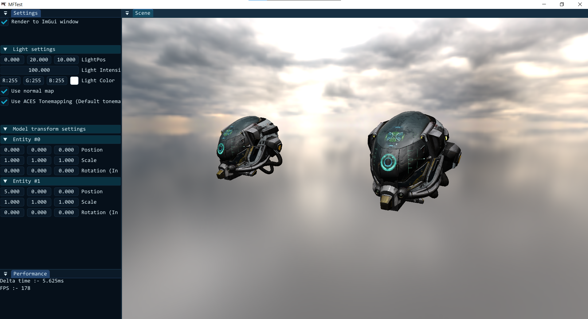

# MFTest

This is a client program which is meant to test the features of the engine core for development purpose.  
This is test is written in C and it linked to MeltedForge through CMake. Note, that the code of this test may  
not be much readable or elegant, since its purpose is to just stress test the engine's core and find bugs, etc.

## Screenshots

 - **PBR *(Without Specular IBL)***

 - **PBR *(With Specular IBL)***
