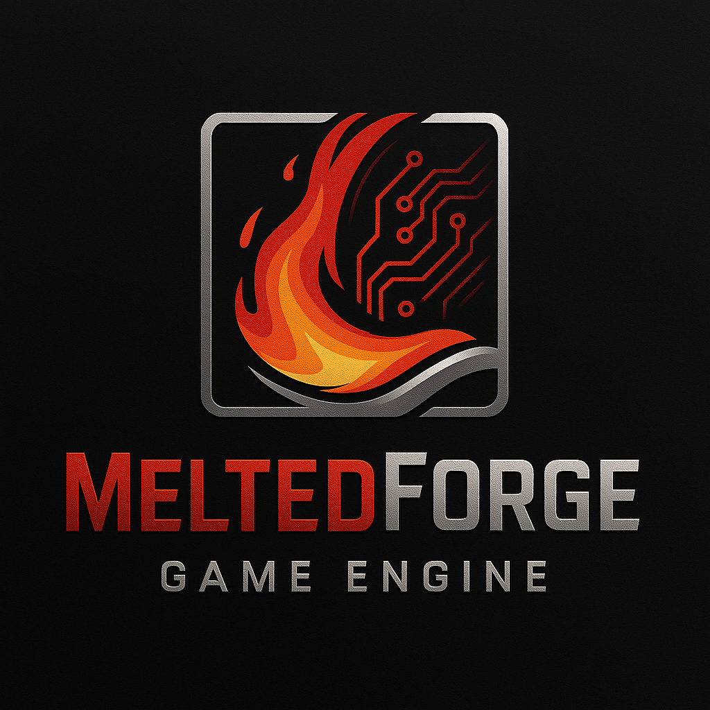

# MeltedForge

**MeltedForge** is a game engine written in **C** using **Vulkan**, with a focus on minimal dependencies, performance, and clean design.

<p align="center">
  
</p>

---

## Features

 - A Basic ECS
   - Material system
   - Basic scene management
 - Model loading along with the material data
    - Can load complex models (Tested with Sponza & Bistro Internal)
 - Engine & editor level UI
    - UI customization (Using Dear ImGui's styles)
 - Render targets
    - Objects with functionality to set the render output to an image, which can be used to render the scene inside an UI panel like the scene viewport
 - A binary serialization/deserialization api
 - Explicit shader resource management control for resources like UBOs and image samplers.

---

## WIP (Work In Progress)
 - Documentation

---

## Reasons for starting

 - Partly to satisfy my curiosity.
 - To showcase what C can really do in game/game engine dev these days
 - To serve as a helpful learning resource for both me (@CloudCodingSpace) and other devs
 - To gain experience in this field

---

## Goals

 - Beginner-friendly setup and usage
 - Low-end devices friendly
 - Cross-platform (Only on desktop platforms)
 - Realistic graphics
 - Sound system support
 - Animation system
 - Multithreading
 - Async resource handling

 ---

## Documentation

> **Note:** The documentation is currently a work in progress. The github repo is [here](https://github.com/CloudCodingSpace/MFDocs).

The deployed url for the docs is [here](https://cloudcodingspace.github.io/MFDocs).
It would be great if it would be pointed out for any grammartical errors or any suggestions spotted. If so, then
it would be much appreciated if a pull request is opened in the documentation's repo.

---

## TODO list

There is a public read-only todo list of this engine.
It is hosted on trello. It can be found [here](https://trello.com/b/Zt1Azhtg/meltedforge) 

---

## Dependencies

> **Note:** The following are the **important conditions** met by the PC for **building/running** MeltedForge

 - Vulkan SDK (Get from [LunarG](https://vulkan.lunarg.com/))
 - A GPU driver with **modern Vulkan support** (Vulkan 1.2.000+)
 - A modern **C & C++** compiler with the support of **latest language standards** with **the corresponding runtime libraries**
    (Preferably GCC & G++ or MSVC, but currently clang is not tested and is not supported)
 - CMake (Get from [here](https://cmake.org/download/))
 - Make if using GCC & G++

---

## Build Instructions

> **Note:** This repo uses submodules. Make sure to clone it **recursively**.

```bash
git clone --recursive https://github.com/CloudCodingSpace/MeltedForge.git
```

The make change the directory into the repo's remote folder/directory. Then create a folder/directory
like bin/out/build for the binary output. Then run the following commands :- 

```bash
cmake -S . -B <path-to-build-dir>
cmake --build <path-to-build-dir> --parallel
```

---

## Technical Details (For developers and nerds)
 - This engine is mostly using C. But there *is* some usage of other languages like C++ since
    3rd party vendors like Dear ImGui and Assimp use it.
 - Currently supports compilers like GCC, G++ and MSVC.
 - Aims at having support for Clang & Clang++, but currently it is not tested and does not have official support for it.
 - Currently tested in and developed on Windows with MSVC and GCC/G++
 - Linux isn't tested yet.

---

## Third party libraries

The third party libraries used in this engine are :-

 - [Stb image](http://github.com/nothings/stb)
 - [Assimp](https://github.com/assimp/assimp/)
 - [Glfw](https://github.com/glfw/glfw)
 - [Slog](https://github.com/CloudCodingSpace/slog)

Licenses for these libraries are included. (In MeltedForge/libs, in their own respective folders)

---

## Acknowledgement

This project may not have been possible if not for some of these sources and communities :-

 - [LearnOpenGL](https://learnopengl.com/) for foundation of graphics
 - [Vulkan tutorial](https://vulkan-tutorial.com/) for basics of vulkan
 - Graphics programming discord server's community. [Link](https://discord.gg/graphicsprogramming)
 - [Polyhaven](https://polyhaven.com/) for free, 3D assets
 - [Khronos's glTF Samples](https://github.com/KhronosGroup/glTF-Sample-Models) for 3D assets
 - NVidia's Bistro scenes.

---

## License

This project is licensed under Zlib license. More details in [LICENSE.txt](./LICENSE.txt).